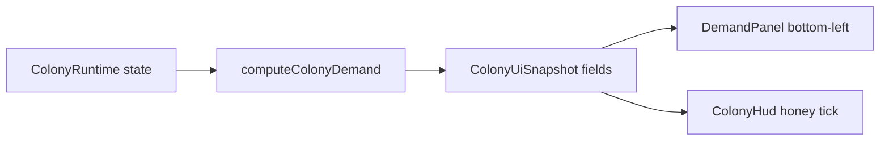

# Demand indicators (nectar / pollen / brood)

## Decisions (from clarifying answers)

1. **Winter marker** lives on the existing **Colony HUD honey meter** (stock needed for Winter), not on the Demand panel.
2. Demand bars answer **what to BUILD**: taller fill = more urgent to place that cell type. Brood also gates on whether **current pollen + nectar/honey stores** can grow a full brood.
3. **No honey demand bar** — only nectar, pollen, brood. Nectar cells cover nectar + honey storage.

## Player-facing UX

### Demand panel (new, bottom-left)

- Compact fixed panel: title **Demand**, three vertical (or short horizontal) icon bars — pollen / nectar / brood.
- Icons only (reuse `HudIcon` SVGs from [`src/ui/colony-hud.tsx`](src/ui/colony-hud.tsx)); no per-bar numbers or sentences.
- `aria-label`s for accessibility (e.g. “Pollen demand high”).
- Sit above / clear of the bottom-center Build toolbar; match existing translucent HUD chrome in [`src/style.css`](src/style.css).
- Always visible during play (same visibility rules as Colony HUD when a game is active).

### Winter tick (Colony HUD honey row)

- On the expanded honey `HudResourceMeter`, draw a vertical tick/marker at  
  `clamp(winterHoneyNeed / honeyCapacity, 0, 1)` along the bar.
- Tooltip / `title`: e.g. `Winter need: X honey` (current stock already shown as the fill).
- Minimized strip: no tick (expanded HUD only), unless a tiny icon badge is trivial later.



## Algorithm

Pure functions in a new module [`src/colony/demand/colony-demand.ts`](src/colony/demand/colony-demand.ts), fed from the same inputs as the UI snapshot (cell stocks, bee count, season length, active constants). Unit-testable without Excalibur.

### Shared helpers

```ts
msPerBeeDay = workerLifespanMs / 50
nectarEquivalent = nectar + honey * honeyNutrientMultiplier
```

Use `getActiveColonyConstants()` for costs/capacities so lineage scaling applies.

### Winter honey need (HUD tick)

Always target a **full Winter** at the current bee count (planning marker):

```ts
winterSec = daysPerSeason * (msPerBeeDay / 1000)
feedsPerBee = (winterSec * hungerPerSec) / hungerRelief
winterHoneyNeed = beesTotal * feedsPerBee * adultFeedHoneyCost
```

- Bee count = workers + queen (anyone with hunger).
- Adults prefer nectar then honey; Winter purges nectar on day 5, so the marker is **honey stock**.
- Tick position uses `honeyCapacity` (nectar cell count × `honeyCellCapacity`). If `winterHoneyNeed > honeyCapacity`, tick clamps to the right edge (signals “build more nectar cells” via Demand as well).

### Outstanding larvae demand

Sum over built brood cells in `larvae` stage:

- `larvaePollenBacklog += larvaePollenRemaining`
- `larvaeNectarBacklog += larvaeNectarRemaining`

Eggs not yet larvae: count as full need (`larvaePollenUnitsNeeded` / `larvaeNectarUnitsNeeded`) so demand anticipates hatch.

### Pollen — should the player build pollen cells?

**Needed pollen** (stock/capacity the hive should be able to hold/serve):

```ts
neededPollen =
  larvaePollenBacklog
  + eggs * larvaePollenUnitsNeeded
  + emptyOrCleaningBrood * larvaePollenUnitsNeeded  // room to raise into empty slots
  + beesTotal * feedsPerBeeDay * adultFeedPollenCost * ADULT_POLLEN_WEIGHT
```

- `feedsPerBeeDay` = `(msPerBeeDay/1000) * hungerPerSec / hungerRelief`
- `ADULT_POLLEN_WEIGHT = 0.25` — adults mostly eat nectar/honey; pollen is backup, so only a fraction of adult metabolism counts toward pollen build demand.

**Demand fill (0–1):**

```ts
capacityFactor = neededPollen / max(1, pollenCapacity)
stressFactor = pollenStored / max(1, pollenCapacity)  // near-full → need more cells to keep foraging
pollenDemand = clamp01(max(capacityFactor - 0.75, 0) / 0.75, stressFactor > 0.9 ? (stressFactor - 0.9) / 0.1 : 0)
```

Interpretation: bar rises when needed approaches/exceeds capacity, or when stores are jammed full.

### Nectar — should the player build nectar cells?

Nectar cells supply both nectar and honey. Need is in **nectar-cell units** (honey-equivalent mapped onto cell capacity):

```ts
neededNectarUnits =
  larvaeNectarBacklog
  + eggs * larvaeNectarUnitsNeeded
  + emptyOrCleaningBrood * larvaeNectarUnitsNeeded
  + beesTotal * feedsPerBeeDay * adultFeedHoneyCost  // adult diet in honey units
  + winterHoneyNeed * WINTER_PLAN_WEIGHT
```

- `WINTER_PLAN_WEIGHT = 0.35` outside Winter, `1.0` in Fall/Winter so nectar-cell build pressure ramps before Winter.
- Compare to `nectarCapacity` / `honeyCapacity` (same cell count; use `honeyCapacity` as the winter-aligned denominator, or `max(nectarCapacity, honeyCapacity)` — they match today).

```ts
capacityFactor = neededNectarUnits / max(1, honeyCapacity)
util = (nectarStored + honeyStored) / max(1, honeyCapacity)
nectarDemand = clamp01(max(capacityFactor - 0.75, 0) / 0.75, util > 0.9 ? … : 0)
```

### Brood — should the player build brood cells?

**Food gate — “enough to grow a full brood”:**

```ts
fullBroodPollen = max(1, broodTotal) * larvaePollenUnitsNeeded
fullBroodNectar = max(1, broodTotal) * larvaeNectarUnitsNeeded
canFeedFullBrood =
  pollenStored >= fullBroodPollen
  && nectarEquivalent >= fullBroodNectar
```

If `broodTotal === 0`, treat as need for **one** larva’s food (`larvaePollenUnitsNeeded` / `larvaeNectarUnitsNeeded`).

**Capacity pressure:**

```ts
emptyRatio = broodEmpty / max(1, broodTotal)  // cleaning counts as empty (same as HUD)
slotPressure = 1 - emptyRatio               // no free slots → 1
```

**Demand:**

```ts
broodDemand = canFeedFullBrood ? clamp01(slotPressure) : 0
```

- Food sufficient + no empty cells → full bar (build brood).
- Food insufficient → **zero** brood demand (build pollen/nectar first; those bars will be up).
- Food OK + many empty cells → low brood demand.

## Data plumbing

1. Extend [`ColonyUiSnapshot`](src/colony/events/colony-events.ts) + Zod schema / default in [`src/schemas/colony-snapshot.ts`](src/schemas/colony-snapshot.ts):

```ts
demandPollen: number;   // 0–1
demandNectar: number;   // 0–1
demandBrood: number;    // 0–1
winterHoneyNeed: number;
```

2. Compute inside [`buildColonyUiSnapshot`](src/colony/colony-ui-snapshot.ts) via `computeColonyDemand(...)` (pass summed stocks, brood stage counts, egg count, larvae remainings, bee totals, season, `daysPerSeason`, constants).

3. New UI [`src/ui/demand-panel.tsx`](src/ui/demand-panel.tsx) mounted from [`App`](src/ui/app.tsx) bottom-left.

4. Extend `HudResourceMeter` to accept optional `markerRatio?: number` + `markerTitle?: string` for the honey winter tick.

## Tunables

Keep magic weights in `colony-demand.ts` (or a small `DEMAND` const next to `COLONY`) so playtest can retune without hunting UI code:

| Constant | Role | Initial |
|----------|------|---------|
| `ADULT_POLLEN_WEIGHT` | Fraction of adult feeds counted as pollen need | `0.25` |
| `WINTER_PLAN_WEIGHT` (Spring/Summer) | How hard winter need pushes nectar build | `0.35` |
| `WINTER_PLAN_WEIGHT` (Fall/Winter) | | `1.0` |
| Capacity soft-start | Demand starts rising at 75% need/capacity | `0.75` |
| Storage stress threshold | Near-full storage bumps demand | `0.9` |

## Testing

- Unit tests for `computeColonyDemand` (Vitest if present; otherwise a small node-assertable pure module test collocated): empty hive, larvae backlog only, full stores + no empty brood, insufficient food + no empty brood (brood demand 0), winter honey need scales with bees and `daysPerSeason`.
- Manual / Playwright smoke optional: Demand panel visible with icons; honey meter has marker when `honeyCapacity > 0`.
- No player-changelog bump unless this ships as a named release (implementer decides at ship time).

## Out of scope

- Separate honey demand bar.
- Auto-selecting Build toolbar type from demand.
- Changing Winter nectar purge or adult diet rules.
- Tutorial rewrite (optional follow-up tip).
