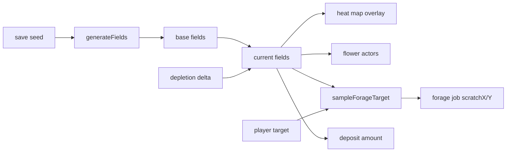

# Forage fields and waggle targeting

Procedurally generated pollen / nectar resource fields, a heat map view of each, and
tap-to-target foraging ("waggle dance"). Adds an active, strategic verb for the stretches
where the hive needs no new comb.

## Problem

Placing cells is the only player verb. When [`computeColonyDemand`](src/colony/demand/colony-demand.ts)
reports no build need, there is nothing to do. Meanwhile the entire outside-hive economy is
invisible and unsteerable:

- [`EconomySystem.pickRandomFlowerDestination`](src/colony/ecs/systems/economy-system.ts) rolls a
  **uniform random** flower tile out of 156 in the Tiled map.
- Deposits are flat (`foragePollenDepositAmount` / `forageNectarDepositAmount` = 3).
- Colony income is therefore `idleWorkerCount × constant` — no lever exists.

`forageTravelMs` is **not** used for pollen/nectar; the outbound leg is distance-based flight at
`beeSpeed × 1.2 × forageFlightSpeedMultiplier`. So a 2.5× throughput spread between near and far
flowers **already exists** and is hidden behind a random roll.

| Target distance | Round trip | Units/sec per forager |
| --------------- | ---------- | --------------------- |
| 400px           | ~5.2s      | 0.58                  |
| 870px           | ~9.7s      | 0.31                  |
| 1200px          | ~13s       | 0.23                  |

## Timescale (drives every tuning value here)

`workerLifespanMs / 50` → **1 bee-day = 4.8s**. Season (15 days) ≈ **72s**; year ≈ 4.8 min.
Anything phrased as "regrows over a few days" means **~15 seconds**. Target cadence for player
retargeting is **2–3 decisions per season**.

## Decisions (from clarifying answers)

1. **Fields are the source of truth.** Heat map, flower visuals, bee targeting, and deposit yield
   are all views of the same two scalar fields. Visuals can never disagree with the heat map.
2. **Two independent layers** (pollen, nectar), generated per save from a stored seed.
3. **No anti-correlation between layers.** Overlap is allowed and desirable — coincident blooms are
   a legitimate jackpot. Double-targeting one meadow double-drains it, so overlap is self-limiting
   through depletion rather than forbidden by the generator.
4. **No within-layer spacing either.** Same-layer blooms that overlap simply sum into a larger,
   richer meadow, which gives free variety in meadow size.
5. **Fixed target radius** (200px), both layers. One tap, no gesture vocabulary. Skill is purely
   positional: where does a known-size circle capture the most field?
6. **Flower actors**, not tilemap repainting. The base map loses its baked flower tiles; flowers are
   spawned as sprites from the field, tinted by dominant layer and scaled by value.
7. **The map does not reroll on succession.** Succession keeps the nest, so it keeps the meadow.
   The seed lives with the colony for its whole lineage.

## World geometry

The Tiled map is 30×30 tiles × 128px × `TILED_BACKGROUND_SCALE` 0.5 = **1920×1920 world px**,
centered on the hive at (0,0), so coordinates run -960…+960. Camera bounds already clamp to exactly
this in [`MyLevel.addTiledBackground`](src/level.ts).

**Field grid: 30×30 at 64px per cell**, aligned 1:1 with the tile grid. 900 cells per layer. 1:1
alignment means flower placement needs no resampling. Bee sampling uses **bilinear interpolation**
so the field reads as smooth rather than stepped.

## Generation

Seeded, dependency-free. Promote the existing `mulberry32` in
[`src/ui/succession-modal.tsx`](src/ui/succession-modal.tsx) to a shared util and reuse it.

**Gaussian blooms, not fBm noise.** Noise yields a uniform speckle where every tap is roughly
equivalent, which removes the decision. Discrete bumps produce distinct, targetable meadows and give
the designer direct control over count / size / richness.

```ts
type Bloom = {
  center: Vector; // world px
  sigma: number; // 120–320px
  amplitude: number; // 0.4–1.0, biased up with distance from hive
  peakSeason: Season; // seasonal falloff multiplier
};
```

Field value at a point = sum of all bloom contributions for that layer, plus a low-amplitude noise
floor for texture, clamped to 0–1.

**Only hard placement rule:** no bloom center within 250px of the hive at (0,0).

### Quality gate (replaces placement constraints)

Generate, score, reroll if degenerate. Preserves full overlap freedom while avoiding bad rolls:

1. At least one bloom per layer in the **near band** (300–550px) — otherwise the opening is brutal.
2. Total field mass per layer within a sane range — no starvation maps, no trivial maps.
3. Blooms not all inside one quadrant — otherwise half the world is dead space.

Reroll up to 10 times; take the best-scoring attempt if none passes clean.

### Seasonal bloom phases

Each bloom's amplitude is multiplied by a falloff from its `peakSeason` (full at peak, ~0.35 one
season out, ~0.1 opposite). The heat map therefore **animates across the year**, and a solved
rotation does not stay solved.

Emergent consequence worth keeping: fall-peaking blooms that generate far from the hive make the
final honey run before winter the most expensive per trip, exactly when `winterHoneyNeed` is driving
the demand panel.

## Depletion and regrowth

Foraging **subtracts from the field locally** — a Gaussian dent at the harvest point. Regrowth pulls
each cell back toward its generated base value.

This is the core feedback loop: the player watches color drain where bees are working and recover
after they move on. It converts the heat map from a reference chart into a live instrument.

- **Drain:** ~1.5% of the cell's base per completed trip, spread over an ~80px Gaussian.
- **Regrowth:** ~2% of base per second toward base → full recovery ≈ half a season.
- **Floor:** regrowth must never target zero globally, or a careless player can soft-lock the colony
  with no recoverable food anywhere.

Net rhythm: a well-placed target sustains ~20–30s before yield visibly sags. Stacking both targets
on one meadow roughly halves that — the feedback that teaches the lesson.

**Winter:** fields freeze — no regrowth, no foraging.
[`cancelWinterForageJobs`](src/colony/economy/winter-forage.ts) already handles the latter. Autumn
depletion therefore carries into spring instead of resetting. (Note the existing winter day-5 nectar
purge in [`SeasonSystem`](src/colony/ecs/systems/season-system.ts) is unrelated and unchanged.)

## Player-facing UX

### Heat map overlay

- **World space**, not DOM — an Excalibur actor z-ordered above the terrain tilemap and below bees,
  so it pans and zooms in alignment with the ground.
- Render the 30×30 field into an offscreen canvas via `putImageData` (one pixel per cell), then draw
  it scaled to 1920×1920 with image smoothing on. The upscale supplies bilinear blur for free.
- Toggle: **Off / Pollen / Nectar**, segmented control styled on
  [`src/ui/demand-panel.tsx`](src/ui/demand-panel.tsx). Never both at once — overlapping amber and
  green renders as mud.
- Palette reuses existing HUD colors: pollen toward `#f7dc6f`, nectar toward `#82e0aa` (both already
  in [`src/ui/app.tsx`](src/ui/app.tsx)).
- Redraw on a dirty flag, throttled to the existing `uiSnapshotMs` (120ms) cadence. Repainting 900
  pixels at ~8fps is free.

### Targeting

- Tap the world to set the active layer's target. A **fixed 200px ring** follows the pointer with a
  tap to commit.
- **Two independent targets**, one per layer, persisted with the save.
- Show **distance from hive** on the ring while placing, so the trip-cost trade-off is visible at
  the moment of decision rather than hidden in the math.
- Both targets may sit on the same spot. Allowed; double-drain is the natural penalty.

### Why 200px

Radius must be sized against bloom sigma. Much larger and the circle always swallows a whole meadow,
so position stops mattering; much smaller and targeting is fiddly on touch. At **0.8–1.2× typical
sigma** the circle captures the core of one meadow but not two, and being off-center visibly costs
yield.

At 200px on a 64px field grid, a target disc covers **~30 field cells** — a healthy population for
weighted sampling — and ~10% of map width. Because blooms vary in sigma (120–320px), **small blooms
fit entirely inside the circle** while **large blooms force a choice of which part to work**. That
supplies burst-vs-sustain texture from the map rather than from a player control.

### Flower actors

The base Tiled map loses its baked flower tiles (plain ground). Flowers are spawned as sprites from
the field:

- One flower sprite family, **tinted** amber (pollen-dominant cell) or violet (nectar-dominant) —
  no new art required.
- **Scaled** by field value; shrink and desaturate as the cell drains, giving depletion feedback with
  the overlay off.
- ~100–200 actors for a typical map. Negligible perf cost.

## Sampling and yield



Replace `pickRandomFlowerDestination` with `sampleForageTarget(layer)`:

- **Target set:** rejection-sample a point inside the disc weighted by field value — pick a random
  point, accept with probability proportional to the field there, a few tries, then take the best
  seen. Bees visibly cluster on the good part of the circle.
- **No target:** sample globally weighted by field value. Strictly better than today's uniform roll,
  so the feature degrades gracefully for a player who never taps.

Deposit amount at the deposit block in
[`economy-system.ts`](src/colony/ecs/systems/economy-system.ts) scales with the sampled cell's field
value, so good targeting is rewarded directly. Keep the existing cell-capacity clamp.

## Data plumbing

1. New pure module `src/colony/foraging/forage-field.ts` — generation, sampling, drain/regrow math,
   quality gate. No Excalibur imports, unit-testable exactly like
   [`colony-demand.ts`](src/colony/demand/colony-demand.ts).
2. New `src/colony/foraging/forage-field-system.ts` — per-tick regrowth, seasonal multiplier, winter
   freeze.
3. Shared `mulberry32` util extracted from
   [`succession-modal.tsx`](src/ui/succession-modal.tsx).
4. [`ColonyRuntime`](src/colony/colony-runtime.ts): `flowerDestinations: Vector[]` is replaced by the
   field state plus the two targets. `setFlowerDestinations` in [`level.ts`](src/level.ts) goes away;
   [`src/tiled/flower-destinations.ts`](src/tiled/flower-destinations.ts) is deleted.
5. [`ColonyUiSnapshot`](src/colony/events/colony-events.ts) + Zod schema and default in
   [`src/schemas/colony-snapshot.ts`](src/schemas/colony-snapshot.ts) gain the active heat map layer
   and both targets.
6. New `src/ui/forage-map-panel.tsx` for the layer toggle; heat map overlay actor under `src/render/`.
7. Save: new `world` block in [`colony-save-types.ts`](src/colony/save/colony-save-types.ts) /
   [`colony-save-codec.ts`](src/colony/save/colony-save-codec.ts) /
   [`colony-save-load.ts`](src/schemas/colony-save-load.ts), optional so existing saves load and get
   a seed assigned on first run.

```ts
world: {
  seed: number;
  generatorVersion: 1;
  pollenDelta: number[];   // sparse / RLE — mostly zeros
  nectarDelta: number[];
  pollenTarget: { x: number; y: number } | null;  // radius is a constant
  nectarTarget: { x: number; y: number } | null;
};
```

**`generatorVersion` is not optional.** Retuning bloom counts or sigmas silently gives every existing
save a *different map* under the same seed — the player's colony wakes up in a world that moved
overnight. Version the generator and keep old versions resident. Cheap now, painful to retrofit.

Succession must **preserve** the whole `world` block. `applySuccessionKeepNestInColony` in
[`colony-succession.ts`](src/colony/colony-succession.ts) rebuilds the controller entity, so field
state must survive that path the way `ColonyTimeComponent` and `BeeswaxComponent` already do.

## Tunables

Keep in a `FORAGE` const beside `COLONY` so playtest can retune without hunting code.

| Constant             | Role                                 | Initial       |
| -------------------- | ------------------------------------ | ------------- |
| `fieldCells`         | Grid per axis (1:1 with tile grid)   | `30`          |
| `bloomsPerLayer`     | Bloom count, per layer               | `5–7`         |
| `bloomSigmaPx`       | Bloom spread                         | `120–320`     |
| `bloomAmplitude`     | Peak value, biased up with distance  | `0.4–1.0`     |
| `hiveExclusionPx`    | No bloom center inside this radius   | `250`         |
| `targetRadiusPx`     | Fixed target disc radius             | `200`         |
| `qualityGateRerolls` | Max regeneration attempts            | `10`          |
| `drainPerTrip`       | Fraction of base drained per trip    | `0.015`       |
| `drainSigmaPx`       | Drain footprint                      | `80`          |
| `regrowPerSec`       | Fraction of base restored per second | `0.02`        |
| `regrowFloor`        | Minimum field value regrowth targets | `0.05`        |
| `seasonFalloff`      | Multiplier at 1 / 2 seasons from peak | `0.35` / `0.1` |

## Testing

- Unit tests for `forage-field.ts` (same style as
  [`colony-demand.test.ts`](src/colony/demand/colony-demand.test.ts)): determinism (same seed → same
  field), quality gate rejects a hand-built degenerate bloom set, drain reduces the sampled value and
  regrowth restores it toward base without exceeding it, seasonal multiplier at peak / ±1 / opposite,
  weighted sampling stays inside the target disc.
- Playwright smoke: heat map toggles Off/Pollen/Nectar; tapping sets a visible ring; save + reload
  reproduces the same field and targets.
- Player changelog bump at ship time per [`AGENTS.md`](../../AGENTS.md).

## Staging

| Step | Scope                                                                     | Risk |
| ---- | ------------------------------------------------------------------------- | ---- |
| 1    | Seeded generator + heat map overlay, read-only. Bees still roll random.    | None |
| 2    | Field-weighted sampling replaces the random roll; yield scales with field. | Low  |
| 3    | Tap-to-target, fixed radius, two targets.                                  | —    |
| 4    | Depletion + regrowth. Feedback loop closes.                                | —    |
| 5    | Seasonal bloom phases, flower actors.                                      | —    |

Steps 1–2 are independently shippable and carry no design risk — step 1 alone makes a third of the
running simulation visible for the first time. Step 3 is the real test of the mechanic.

## Out of scope

- Player-adjustable target radius (fixed at 200px; a natural lineage-affix axis later).
- Scouting trips / information decay / stale-patch fog.
- Weather and forecast.
- Pollen nutritional diversity.
- Water foraging (`forageWater` keeps its current behavior).
- Terrain generation beyond flower placement — ground tiles stay hand-authored.
