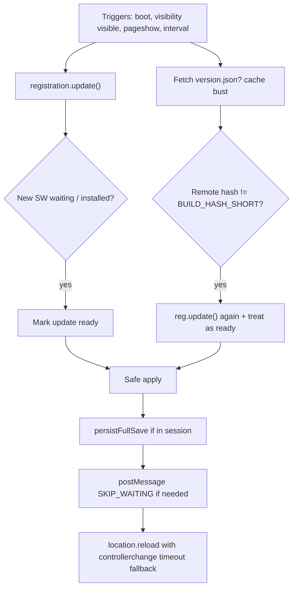

# PWA runtime update detection

## Problem

Bee Happy is a client-only PWA (`vite-plugin-pwa` + custom Workbox injectManifest SW) deployed to **GitHub Pages**. After a deploy, installed clients—especially **iOS home-screen PWAs**—often need **multiple launches** before the new build runs.

That matches known WebKit / standalone PWA behavior: background resume is not a full navigation, service-worker update checks are delayed or skipped, `controllerchange` is unreliable after `skipWaiting`, and GitHub Pages gives little control over `Cache-Control` for `sw.js` / `index.html`.

## Current state

| Piece | Today |
| --- | --- |
| Plugin | `VitePWA({ strategies: "injectManifest", registerType: "autoUpdate", ... })` in `vite.config.js` |
| SW | `src/sw.ts`: `skipWaiting()` + `clientsClaim()` + `precacheAndRoute(self.__WB_MANIFEST)` only |
| Client registration | Implicit plugin inject (`registerType: "autoUpdate"`); **no** app code imports `virtual:pwa-register` |
| Update triggers | Browser default only (typically on navigation / SW script lifetime). No `registration.update()` on resume |
| Build identity | `__COMMIT_HASH__` → `BUILD_HASH_SHORT` shown in HUD; not used for update detection |
| Lifecycle | Autosave every 30s + save on `visibilitychange` / `pagehide` (good for safe reload) |
| Hosting | GitHub Pages via `.github/workflows/deploy-github-pages.yml` (no custom cache headers) |

`autoUpdate` + `skipWaiting` / `clientsClaim` is the right *intent*, but it only helps when the browser actually **checks** for a new SW and the page **reloads** onto the new controller. iOS often fails one or both steps while the app stays warm in memory.

## Goals

1. While the app is open (or returns from background), detect that a newer build is on the server.
2. Activate the new service worker and load the new shell **without** requiring multiple cold starts.
3. Never wipe or corrupt colony saves; prefer save-then-reload.
4. Keep offline / precache behavior for hashed assets.
5. Stay within GitHub Pages constraints (no backend push channel).

Non-goals for the first cut: remote config, A/B builds, partial hot module swap of Excalibur/React without reload.

## Recommended design

Use **two detection layers** and **one apply path**.



### Layer A — Opportunistic service worker update checks (primary)

Stop relying only on the injected auto-register script. Own registration in app code:

1. Set `injectRegister: false` (or keep `auto` but **import** `virtual:pwa-register` so registration is explicit and controllable).
2. Call `registerSW` / Workbox `Workbox` early from boot (e.g. `src/pwa/register-pwa-updates.ts` imported from `main.tsx`).
3. On each check trigger, call `registration.update()`:
   - once at startup (after register)
   - when `document.visibilityState` becomes `"visible"` (covers iOS resume)
   - on `pageshow` when `event.persisted` (bfcache)
   - on `window` `focus` (cheap extra signal for standalone)
   - on a quiet interval while visible (e.g. **15–30 minutes**; not every few seconds)
4. Debounce checks (e.g. min 60s between `update()` calls) so resume spam does not hammer Pages.

Keep `skipWaiting` + `clientsClaim` in `sw.ts`, but also handle **page-driven** activation:

- Listen for waiting worker (`onNeedRefresh` from `virtual:pwa-register`, or `reg.waiting` / `updatefound` → `installed`).
- When applying: `waiting.postMessage({ type: 'SKIP_WAITING' })` **and** ensure `sw.ts` has a `message` listener for `SKIP_WAITING` (idempotent with top-level `skipWaiting()`).
- Reload on `controllerchange`, with an **iOS fallback**: if `controllerchange` does not fire within ~1–2s after skipWaiting, call `window.location.reload()` anyway.

This mirrors the WebKit workaround landed / discussed around vite-plugin-pwa (prompt mode + timeout fallback).

### Layer B — Version beacon (fallback for GitHub Pages / stuck SW)

Emit a tiny **unprecached** file at build time, e.g. `public/version.json` generated in the Vite config / a small plugin:

```json
{ "commit": "<short hash>", "releaseId": "<package version / currentReleaseId>" }
```

Rules:

- **Do not** include `version.json` in the Workbox precache manifest (`injectManifest` / `globIgnores`).
- Fetch with `cache: "no-store"` and a cache-bust query (`?t=${Date.now()}`) on the same triggers as Layer A (or a slightly slower interval).
- Compare `commit` to `BUILD_HASH_SHORT` (or full `__COMMIT_HASH__`).
- On mismatch: treat as “update available” even if the SW has not yet reported waiting—call `registration.update()` and enter the apply path / prompt. If the SW still will not update (rare HTTP cache of `sw.js`), a full reload after `update()` still often picks up a new `index.html` navigation on the next document load; document residual risk for GH Pages.

Optional hardening later: rename / hash-bust is not allowed for the SW URL itself; if SW caching remains painful, consider migrating hosting to something that can send `Cache-Control: no-cache` for `/sw.js` and `/index.html`. That is **hosting**, not app logic—call it out but do not block the client mechanism.

### Apply UX (game-safe)

Do **not** blind-reload mid-placement or mid-modal without saving.

| Context | Behavior |
| --- | --- |
| Launch menu / boot (no active colony session) | Auto-apply: activate SW + reload immediately |
| In-game | Soft prompt: “Update available — save and reload” (primary CTA). On accept: `persistFullSave()` then apply. Secondary: dismiss until next resume/check |
| App returning from background with update already waiting | Same as in-game if session active; auto if on launch menu |

Reuse existing patterns: settings already does `persistFullSave()` + `location.reload()` for “Restart game”. An update banner/toast can sit above the HUD without becoming a card-heavy dashboard.

Wire into existing lifecycle:

- Reuse the same save-on-hide path; before forced reload always save once more.
- After reload, existing What’s new modal still works via `currentReleaseId` / last-seen storage—no change required for changelog.

### SW / plugin config tweaks

In `src/sw.ts`:

- Keep precache + cleanup.
- Keep `skipWaiting` / `clientsClaim` for browsers that honor install-time skipWaiting.
- Add `message` handler for `{ type: 'SKIP_WAITING' }` so client-driven activation works when install-time skipWaiting is ignored (reported on some iOS standalone builds).

In `vite.config.js`:

- Prefer explicit client registration (`injectRegister: false` + app import) so update callbacks are testable.
- Keep `registerType: "autoUpdate"` **or** switch to `"prompt"` if UX is always user-confirmed in-game; functionally the app will own the prompt either way—**prompt + custom UI** is clearer than fighting auto-injected reload timing.
- Ensure `version.json` (if used) is copied to `dist` and excluded from precache.

### Testing

Automated (Playwright, Chromium):

- With a second built artifact or mocked SW update is hard on GH Pages preview; at minimum unit-test the compare helper and “should prompt vs auto-reload” policy.
- Optional: Playwright with two service worker scripts is brittle—treat as best-effort.

Manual (required for the real bug):

1. Install PWA to iOS home screen on a build known as A.
2. Deploy build B.
3. Leave A open in background → foreground: expect check within debounce → prompt or reload.
4. Cold kill A, open once: expect update on first or second open at worst (target: first open after foreground check, or single relaunch).
5. Confirm save slot survives reload; What’s new appears when `currentReleaseId` bumped.
6. Repeat on desktop Chromium installed PWA / Safari for regression.

## Implementation sketch (files)

| File | Role |
| --- | --- |
| `src/pwa/register-pwa-updates.ts` | registerSW, triggers, debounce, apply with timeout reload |
| `src/pwa/version-beacon.ts` | fetch/compare `version.json` |
| `src/pwa/update-policy.ts` | auto vs prompt based on “has active game session” |
| `src/ui/update-available-banner.tsx` | minimal in-game CTA |
| `src/sw.ts` | SKIP_WAITING message listener |
| `vite.config.js` | emit `version.json`, exclude from precache, registration options |
| `src/main.tsx` / `BootRoot` | start update supervisor at boot |

## Decision summary

- **Primary:** periodic + resume `registration.update()` with explicit activate + reload (iOS timeout fallback).
- **Secondary:** unprecached `version.json` beacon because GitHub Pages cannot set SW cache headers.
- **Apply:** auto on launch menu; save-then-prompt in gameplay.
- **Do not** remove precaching; do not rely on `autoUpdate` inject alone.

## Risks

- Mid-game reload still interrupts play; mitigate with prompt + save.
- GitHub Pages may still cache `sw.js` aggressively in edge cases; beacon + `update()` minimize but may not eliminate a rare extra launch.
- Double-reload if both `controllerchange` and timeout fire—guard with a module-level `reloading` flag.
