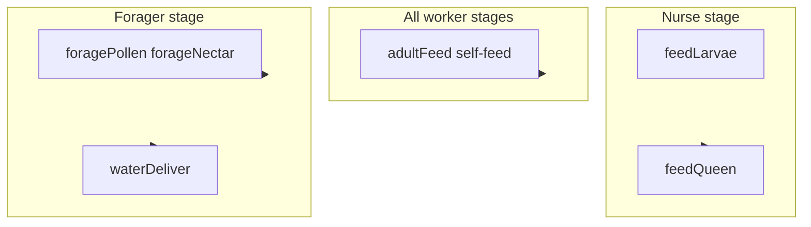

# Worker bee aging and lifecycle (revised)

## Purpose

Add worker age over **50 bee-days**, five lifecycle stages, and **stage-preferred job prioritization** (soft bias, not a hard restriction). This revision incorporates **queen feeding as its own job**, **self-feeding workers** (replacing worker-to-worker `adultFeed` semantics), **water delivery by foragers only**, and a **three-phase forage + deposit + wait** flow for pollen and nectar.

---

## Current baseline (code today)

- `JobKind` and workers: `[src/colony/ecs/components/colony-components.ts](src/colony/ecs/components/colony-components.ts)`.
- Assignment: nearest available worker + role check `[src/colony/ecs/systems/job-assignment-system.ts](src/colony/ecs/systems/job-assignment-system.ts)`, `[src/colony/ecs/job-eligibility.ts](src/colony/ecs/job-eligibility.ts)`.
- `adultFeed` / `waterDeliver`: chase target bee, spawned by `[src/colony/ecs/systems/adult-care-system.ts](src/colony/ecs/systems/adult-care-system.ts)`.
- Forage: outbound → wait → return; deposit logic in economy update `[src/colony/ecs/systems/economy-system.ts](src/colony/ecs/systems/economy-system.ts)` (not a separate “find nearest cell with capacity” deposit leg).
- Master job reference: `[.cursor/plans/jobs-system-master-plan.md](.cursor/plans/jobs-system-master-plan.md)`.

---

## Lifecycle stages and job eligibility

Bee-days use the same **1–2 / 3–11 / 12–17 / 18–21 / 22–50** boundaries as biology. **Ms per bee-day** = `COLONY.workerLifespanMs / 50` (tunable; e.g. ~4 min total life → ~4.8 s per day).

| Stage               | Bee days | Preferred jobs (workers)                                        |
| ------------------- | -------- | ----------------------------------------------------------------- |
| Cleaning            | 1–2      | `cleanBrood`                                                      |
| Nurse               | 3–11     | `feedLarvae`, `**feedQueen`**                                     |
| Builder / processor | 12–17    | `buildCell`, `honeyProcess`                                       |
| Guard               | 18–21    | `guardHive` (new; MVP patrol/timer at entrance)                   |
| Forager             | 22–50    | `foragePollen`, `forageNectar`, `forageWater`, `**waterDeliver`** |

`**adultFeed` (revised):** Available to **all worker stages** (hunger is not stage-gated). Stage preference biases assignment order rather than preventing self-feeding.

**Queen:** Still only `layEgg` when/if that job is used; no change to queen role table except new worker job `feedQueen` targeting her.

---

## New job: `feedQueen`

- **Who:** **Nurse stage only** (days 3–11).
- **What:** Worker paths to the **queen** and performs a timed interaction: feed **royal jelly**. Jelly is **implicit** (no inventory): the nurse “produces” it for the purpose of the interaction—no colony resource spend required for MVP, or optional future hook if you add a resource.
- **Spawn:** When queen crosses hunger (or a dedicated queen-hunger channel), spawn **at most one** open `feedQueen` job (mirror “no duplicate per target” pattern from current adult care).
- **Completion:** `[AdultCareSystem](src/colony/ecs/systems/adult-care-system.ts)` (or split `QueenCareSystem`) reduces queen hunger / applies relief; job `done`, entity removed, bee released.
- **Movement:** Similar to current chase jobs: empty `pathPoints`, steer toward queen in `[MovementSystem](src/colony/ecs/systems/movement-system.ts)`; add `feedQueen` to the same special-case list as `adultFeed` / `waterDeliver` today.
- **Docs:** New row in [job registry](.cursor/plans/jobs-system-master-plan.md); add `JobPriority` key; extend eligibility.

---

## Revised job: `adultFeed` (self-feeding for all workers)

**Goal:** Any **hungry worker** (any lifecycle stage) feeds **itself** by moving to the **nearest** appropriate source and consuming until no longer hungry (or until resources run out—define UX: remain hungry and idle, or retry later).

- **Targets:** Nearest built cell with capacity: **pollen** storage for pollen portion of hunger (if you model mixed diet), **nectar / honey** for the rest—match existing hunger relief rules in `[COLONY](src/colony/constants.ts)` and `[AdultCareSystem](src/colony/ecs/systems/adult-care-system.ts)` after refactor.
- **Flow (conceptual):** Spawn job per hungry worker (or one job with phases): **path to cell** (hex path like `buildCell`) → **in-range consume** (timer or per-tick drain like larvae feed) → release when `hunger` below threshold.
- **Assignment:** Nearest worker is **the hungry bee itself** (job entity may carry `targetBeeId` = self, or use a component flag). **Important:** Avoid every hungry bee grabbing the same cell: serialize or reserve cell, or pick per-bee nearest at assignment time and re-plan if depleted.
- **Removal:** Stop spawning worker→worker feed jobs; queen uses `**feedQueen`** only, not `adultFeed`.
- **Systems:** Refactor `[AdultCareSystem](src/colony/ecs/systems/adult-care-system.ts)` (and possibly `[MovementSystem](src/colony/ecs/systems/movement-system.ts)`, `[EconomySystem](src/colony/ecs/systems/economy-system.ts)`) so `adultFeed` no longer chases another bee except implicitly “self.”

---

## Revised job: `waterDeliver` (forager only)

- **Who:** **Forager stage** (days 22–50) only—nurses no longer perform this job.
- **What:** Unchanged high-level idea: thirsty **target** bee (queen or worker) gets water; worker chases target and relieves thirst within radius.
- **Spawn:** `[AdultCareSystem](src/colony/ecs/systems/adult-care-system.ts)` still creates jobs on thirst threshold, but **only foragers** can be reserved; if no forager is free, job stays open (queue) or you add a starvation warning later.
- **Eligibility:** Stage filter excludes non-foragers from `waterDeliver` assignment.

---

## Revised flow: `foragePollen` and `forageNectar`

Replace the current “return then instant deposit in `updateForage`” with an explicit **in-hive deposit leg** and **capacity wait**.

**Phases (extend `JobComponent` or use a dedicated sub-state):**

1. **Outbound** — Travel to off-hive forage point (current `scratchX` / `scratchY` pattern).
2. **Wait** — Gather (existing `forageWaitMs`).
3. **Return** — Travel back to hive (existing return leg).
4. **Depositing** — Path to **nearest** built cell of matching type (`pollen` / `nectar`) with **remaining capacity** (pollen below `pollenCellCapacity`, nectar below `nectarCellCapacity`). Apply carry to that cell on arrival / in range (same radius patterns as other cell jobs).
5. **Waiting** — If **no** cell has capacity, bee enters **waiting** state at hive (hold position or idle zone); **re-evaluate** periodically (e.g. every N ms or when a cell gains capacity via events) until a slot opens or job is cancelled.

**Notes:**

- **Nectar “full”** may interact with honey lock rules (`honeyStored` above 0 blocks nectar); mirror existing economy rules when choosing deposit targets.
- `**forageWater`** can stay on the old three-phase model for MVP **or** be aligned with deposit-to-water storage if you add cells later; call out in implementation.
- **Movement:** After return, **do not** complete job in `EconomySystem` until deposit succeeds or explicit fail; `pathPoints` may need to be rebuilt when transitioning from return → depositing.
- **Job assignment:** Initial reservation still picks nearest forager to job anchor; deposit target is **dynamic** (computed when entering depositing phase).

---

## Architecture sketch

---

## HUD: current day

Show a **colony calendar day** on the main HUD so time progression is visible at a glance.

- **Definition:** A **global** counter on the colony controller (not per-bee age). Advance `**colonyElapsedMs`** each frame by simulation `elapsed`, same clock as other systems. Let `**msPerBeeDay` = `COLONY.workerLifespanMs / 50`**. Display **1-based day**: `currentColonyDay = Math.floor(colonyElapsedMs / msPerBeeDay) + 1` (tunable label, e.g. “Day 12”). This keeps one “bee-day” unit consistent with worker lifespan scaling.
- **Wire-up:** Add `currentColonyDay` (or `colonyDay`) to `[ColonyUiSnapshot](src/colony/events/colony-events.ts)` and populate it in `[ColonyRuntime.getUiSnapshot](src/colony/colony-runtime.ts)` / throttled emit path. Mirror the field in `[src/schemas/colony-snapshot.ts](src/schemas/colony-snapshot.ts)`. Extend `[defaultSnapshot](src/ui/app.tsx)` and render a line in the `.hud-card` (e.g. next to level or below the title).
- **Edge cases:** Day increments while the game is running (pause/menu not in scope unless you add engine pause later). No cap required; optional “Season” grouping can be a later enhancement.

---

## Implementation todos (ordered)

1. **Model** — `BeeAgeComponent`, `COLONY.workerLifespanMs`, stage breakpoints, bootstrap aged workers, lifecycle system (age tick, death, job release); **colony elapsed ms + `msPerBeeDay` on controller for HUD day**.
2. **HUD day** — Expose `currentColonyDay` in `ColonyUiSnapshot`, Zod schema, and `[App](src/ui/app.tsx)` HUD card.
3. `**feedQueen`** — New `JobKind`, priority, spawn on queen hunger, chase queen, complete + relief, registry + eligibility (nurse only).
4. `**adultFeed` refactor** — Self-feed only; hex path to nearest valid cell; consume until not hungry; queen excluded; all stages eligible for workers.
5. `**waterDeliver`** — Restrict assignment to forager stage; adjust spawn if needed so jobs do not assume nurses exist.
6. **Forage deposit + wait** — Extend `JobComponent` state machine for pollen/nectar; nearest-capacity cell resolution; waiting loop; update `EconomySystem` / `MovementSystem` / assignment as needed.
7. `**guardHive`** — MVP guard job and stage filter (from prior plan).
8. **Assignment** — Centralize `isWorkerAssignableToJobKind(stage, kind)` and filter in `[JobAssignmentSystem](src/colony/ecs/systems/job-assignment-system.ts)`.
9. **Docs** — Update [jobs-system-master-plan.md](.cursor/plans/jobs-system-master-plan.md): registry rows for `feedQueen`, revised `adultFeed` / `waterDeliver` / forage flows, lifecycle subsection.

---

## Risks

| Risk                                  | Mitigation                                                                                                         |
| ------------------------------------- | ------------------------------------------------------------------------------------------------------------------ |
| Thirsty colony but no foragers yet    | Queue `waterDeliver`; tune bootstrap to include some foragers; or temporary “emergency” override (off by default). |
| Self-feed job stampede on one cell    | Per-job target cell, small reservation, or nearest with free capacity heuristic.                                   |
| Foragers stuck in **waiting** forever | HUD/debug indicator; optional job timeout returning payload to abstract “cache” (later).                           |

---

## Changelog

| Date       | Change                                                                                                                                           |
| ---------- | ------------------------------------------------------------------------------------------------------------------------------------------------ |
| 2025-03-26 | Initial lifecycle plan (separate doc).                                                                                                           |
| 2025-03-26 | Revision: `feedQueen` (nurse); `adultFeed` self-feed all stages; `waterDeliver` forager-only; forage pollen/nectar with deposit + capacity wait. |
| 2025-03-26 | HUD: colony **current day** on snapshot + React HUD (`msPerBeeDay`, 1-based).                                                                    |

